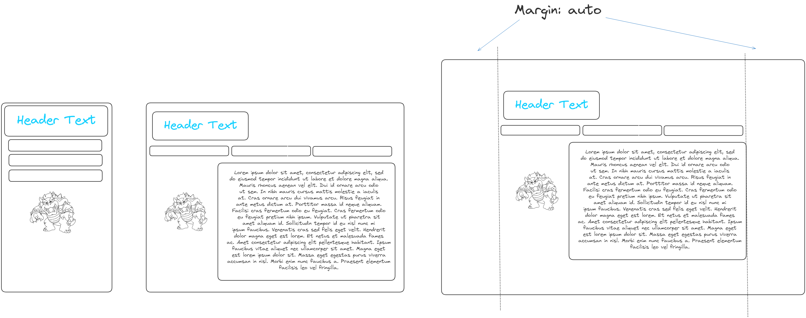

## Table of contents
1.  Overview
2.  Features
3.  Getting started
    - git

# Features
## Email input feature
### html
```html
    <form id ="login-form">
        <input id="email" type="email" name = "email>
        <input>
    </form>
```
### css
```css
    .login-form{
        background-color: lightgrey;
    }
```


...

## Demo of some .md features for your use
1. Making links in markdown...

* [link visible text](https://jbt.github.io/markdown-editor/)
* [https://jbt.github.io/markdown-editor/)](https://jbt.github.io/markdown-editor/)


2. Wireframes for different form factors
### format:
```md

```
| NOTE: might need to right-click and 'copy image link'
|       rather than just 'copy link'



3. For more see...
For more see
[github markdown cheatsheet](https://docs.github.com/en/get-started/writing-on-github/getting-started-with-writing-and-formatting-on-github/basic-writing-and-formatting-syntax).